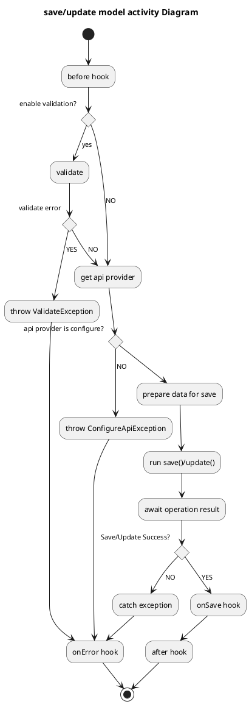

# Usage

Consider the following model as an example:
```typescript

import { IModelApiProvider, Model, TMutations, TRules } from '@zidadindimon/vue-mc';

export type TTaskInitData = {
  id?: number;
  title?: string;
  description?: string;
  createdAt?: number;
  done?: boolean;
  data?: any;
  author? : {
    firstName: string;
    lastName: string;
  }
}
export type TTaskSaveData = TTaskInitData;

export type TTaskFetchOpt = {
  id: number;
}

export type TTaskDelOpt = {
  id: number;
}

export class TaskModel extends Model<TTaskInitData, TTaskSaveData, TTaskFetchOpt, TTaskDelOpt> {
  /**
   * @comment enable validation before save/update
   * @default true
   */
  protected _validationBeforeSave = true;

  /**
   * @comment attribute for model
   */
  id: number = null;
  title: string = null;
  description: string = null;
  createdAt: Date = new Date();
  done: boolean = false;
  author: string;

  /**
   * @comment computed property
   */
  get dateFormat(): string {
    return this.createdAt.toDateString();
  }

  /**
   * @comment mutate initial data before apply to model
   */
  protected mutations(data: TTaskInitData): TMutations<TaskModel> {
    return {
      createdAt: () => new Date(data.createdAt),
      author: () => data.author ? `${data.author.firstName} ${data.author.lastName}`: ''
    };
  }

  /**
   * @comment hook run after call init method
   */
  protected onInit() {
    super.onInit();
  }

  /**
   * @comment rule for validate model before save/update
   */
  rules(): TRules<TaskModel> {
    return {
      title: [
        v => !!v || 'Title can`t be empty',
      ],
      description: [
        v => !!v || 'Description can`t be empty',
        v => v.length > 15 || 'Description must be more 15 symbols',
      ],
    };
  }

  /**
   * @comment mutate data before save/update
   * @default method empty
   */
  protected mutateBeforeSave(): TMutations<TTaskInitData> {
    return {
      id: this.id,
      title: this.title,
      description: this.description,
      done: this.done,
      createdAt: () => this.createdAt.valueOf(),
    };
  }

  /**
   * @comment configure api method
   */
  protected api(): IModelApiProvider<TTaskInitData, TTaskSaveData, TTaskFetchOpt, TTaskDelOpt> {
    return {
      async fetch(data?: TTaskFetchOpt): Promise<TTaskInitData> {
        return {
          id: data.id,
          title: `Task #${data.id}`,
          description: 'Description of task'
        };
      },
      async save(data?: TTaskSaveData): Promise<any> {
      },
      async update(data?: TTaskInitData): Promise<any> {
      },
      async delete(data?: TTaskDelOpt): Promise<any> {
      },
    };
  }

  /**
   * @comment hook run after safe/update method
   */
  protected onSave(data: any): void {
  }

  /**
   * @comment hook run after delete method
   */
  protected onDelete(data: any): void {
  }

  /**
   * @comment hook that call when GRUD operation is fail
   *
   */
  protected onError(exception: Error) {
    /**
     * pats your code hear
     */
    super.onError(exception);
  }

  /**
   * @comment hook run after any GRUD method
   */
  protected after() {
    super.after();
  }

  /**
   * @comment hook run before any GRUD method
   */
  protected before() {
    super.before();
  }

  /**
   * @comment configure delete filter options
   */
  protected get deleteOptions(): TTaskDelOpt {
    return { id: this.id };
  }
}
```

# Create model class

Розглянемо клас `TaskModel` 
```typescript
export class TaskModel extends Model<TTaskInitData, TTaskSaveData, TTaskFetchOpt, TTaskDelOpt> {
/**
 * other code here
 */  
}
```

When extends the `Model` class, it is advisable to specify generic types. 
They are responsible for the following:  
* D - interface for initial data, or output data of `fetch` method
* SD - interface for input data that use when model save or update   
* FO - interface for input data that use method `fetch` 
* DO - interface for input data that use method `delete`
 


# Initialize 
 
```typescript
const model = new TaskModel();
```
or
```typescript
const data: TTaskInitData = {
      id: 1,
      title: 'Title',
      description: 'Description',
      createdAt: new Date().valueOf(),
      done: false
    }
const model = new TaskModel().init(data, false);
```
after call `init` method called onInit hook

# Default value
In order to specify a default value, it is enough to specify the attributes of the model and set them values. 

```typescript
  /**
   * attribute for model
   */
  id: number = null;
  title: string = null;
  description: string = null;
  createdAt: Date = new Date();
  done: boolean = false;
  author: string;

``` 

:warning: Always specify a default value or `null` for attributes to be reactive; 

# Mutations

When you want to bring the input (types) to the model data (types), you can use the `mutations` 
method as shown in the example below

```typescript
  /**
   * @comment mutate initial data before apply to model
   */
  protected mutations(data: TTaskInitData): TMutations<TaskModel> {
    return {
      createdAt: () => new Date(data.createdAt),
      author: () => data.author ? `${data.author.firstName} ${data.author.lastName}`: ''
    };
  }
```   
# Computed value

Computed value in model is a simply getter
```typescript
/**
   * @comment computed property
   */
  get dateFormat(): string {
    return this.createdAt.toDateString();
  }
```

# GRUD operation 
 
Api of `Model` provide next api operation:
* `fetch` - initialize model from some source
* `save` - create new record on some source    
* `update` - update record on some source
* `delete` - delete record in some  source

Configure api provider:
```typescript
  /**
   * @comment configure api method
   */
  protected api(): IModelApiProvider<TTaskInitData, TTaskInitData, TTaskFetchOpt, TTaskDelOpt> {
    return {
      async fetch(data?: TTaskFetchOpt): Promise<TTaskInitData> {
        return {
          ...
        };
      },
      async save(data?: TTaskInitData): Promise<any> {
      },
      async update(data?: TTaskInitData): Promise<any> {
      },
      async delete(data?: TTaskDelOpt): Promise<any> {
      },
    }
  }
```  
or 
```typescript

const model = new TaskModel();
model.useApi({
    async fetch(data?: TTaskFetchOpt): Promise<TTaskInitData> {
      return {};
    },
    async save(data?: TTaskInitData): Promise<any> {
    },
    async update(data?: TTaskInitData): Promise<any> {
    },
    async delete(data?: TTaskDelOpt): Promise<any> {
    },
  },
);
```
When api is configure we can use it:




# Save/Update model
```typescript
const model = new TaskModel();
/**
 * model has flag isNew = true
 */
model.save() // call api.save if success than isNew = false
model.save() // call api.update because isNew = false
```
after save operation call hook `onSave`

# Delete 

    configure delete options
```typescript
/**
   * @comment configure delete filter options
   */
  protected get deleteOptions(): TTaskDelOpt {
    return { id: this.id };
  }
```
usage 
```typescript
const model = new TaskModel();
...
model.delete()
```
after delete operation call hook `onDelete`

# Fetch 
* first variant 
 ```typescript
  const id = 1;
  const model = await TaskModel.fetch<TaskModel>({ id });
```  
* second variant
 ```typescript
const model = new TaskModel();
await model.fetch({id: 1})
```
after success operation call `onInit` hook 

# Hooks

If need do something after `init` / `fetch` / `save` / `delete` method we can use api hook:
```typescript
 /**
   * @comment hook run after call init method
   */
  protected onInit() {
    super.onInit();
  }

 /**
   * @comment hook run after safe/update method
   */
  protected onSave(data: any): void {
  }

  /**
   * @comment hook run after delete method
   */
  protected onDelete(data: any): void {
  }

  /**
   * @comment hook that call when GRUD operation is fail
   *
   */
  protected onError(exception: Error) {
    /**
     * pats your code hear
     */
    super.onError(exception);
  }

  /**
   * @comment hook run after any GRUD method
   */
  protected after() {
    super.after();
  }

  /**
   * @comment hook run before any GRUD method
   */
  protected before() {
    super.before();
  }
```
# Validation

If need validate date before save or update operation model has validation mechanic.
On this situation you can wrive validation rules for model.

```typescript
/**
   * @comment rule for validate model before save/update
   */
  rules(): TRules<TaskModel> {
    return {
      title: [
        v => !!v || 'Title can`t be empty',
      ],
      description: [
        v => !!v || 'Description can`t be empty',
        v => v.length > 15 || 'Description must be more 15 symbols',
      ],
    };
  }
```  
If call save method and validation failed than method throw `ValidateException`;   

Get validation error:  
```typescript
console.log(model.error) // Model error obj -> {model: Error message for oll model, attrs: {[attributeName]: errorMessage}} 
```

if you want disable validation before save or update use next:
```typescript
/**
   * @comment enable validation before save/update
   * @default true
   */
  protected _validationBeforeSave = true;
```
